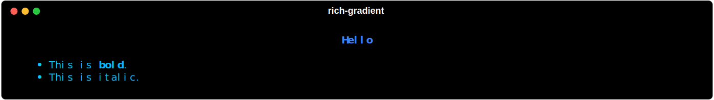

# rich-gradient-cli

`rich-gradient-cli` is a command-line interface for the [`rich-gradient`](https://github.com/maxludden/rich-gradient) library. It lets you render colorful gradients in terminal text, rules, panels, and markdown output.

## Quickstart

```bash
uv add rich-gradient-cli
```

```bash
gradient print --colors 'red,#ff9900,#ffff00' \
    "This is gradient text that starts red, \
    transitions through orange, and ends in yellow!"
```


## Why it exists

- Make terminal output easier to scan with color transitions
- Render rich gradient panels and rules without custom code
- Pipe and transform text or markdown from other CLI tools

## Commands at a glance

<video
  src="assets/rich-gradient-cli-help.mp4"
  controls
  muted>
</video>


## Examples

```bash
gradient rule --colors 'blue,#00ff00,cyan' "Blue to Green to Cyan Rule"
```


```bash
gradient panel --colors "red,#ff9999" -t "Error" --title-style "bold #ffffff" --title-align left 'This is an error message with a red to pink gradient background.'
```


```bash
echo "# Hello\n\n- This is **bold**.\n- This is *italic*." | gradient markdown -
```



<div align="center">
  <a href="https://github.com/maxludden/maxludden" style="text-decoration:none; color:inherit;">
      <p>Designed by Max Ludden</p>
  </a>
  <br />
  <a href="https://github.com/maxludden/maxludden" style="text-decoration:none; color:inherit;">
    
  </a>
</div>
