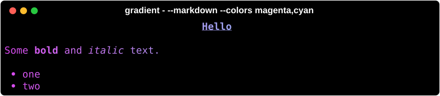
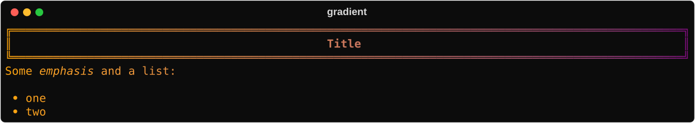
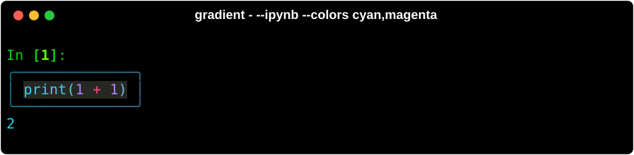
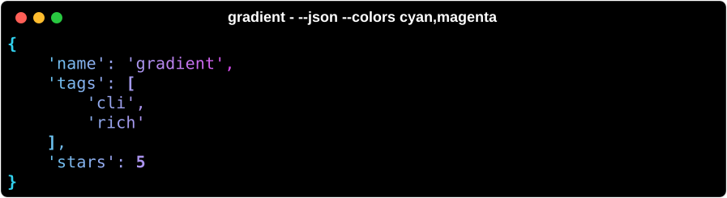
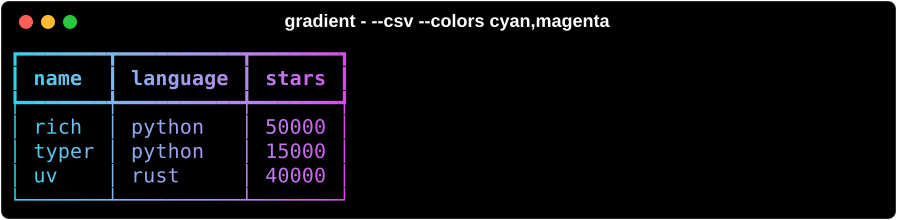
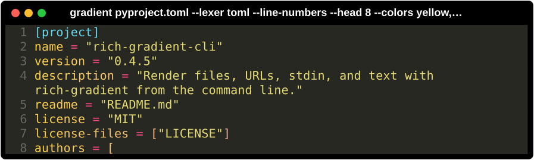
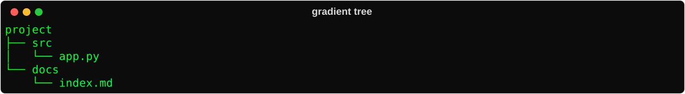
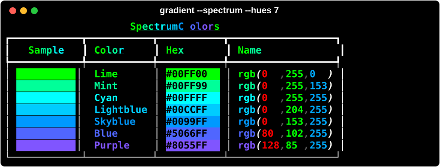
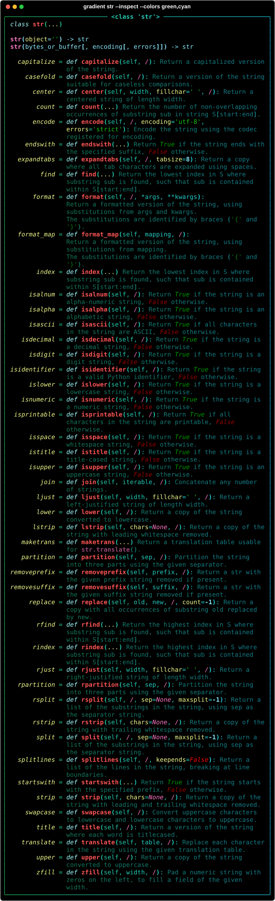

# Usage

## Installation

`rich-gradient-cli` requires Python 3.11 or newer. Install it with any of:

```bash
uv tool install rich-gradient-cli               # uv
pip install rich-gradient-cli                   # pip
brew install maxludden/tap/rich-gradient-cli    # Homebrew
```

Check that it works with `gradient --version`.

## Text

Literal text and stdin are printed as gradient text. Rich console markup such as `[b]bold[/b]` is parsed unless you pass `--no-markup`.

```bash
gradient --colors 'red,#ff9900,#ffff00' "Hello [b]gradient[/b]"
echo "piped text" | gradient - --colors cyan,magenta
```


To style particular words or patterns, use `--highlight-word WORD=STYLE` or `--highlight-regex PATTERN=STYLE`. Both can be repeated.

```bash
gradient --colors magenta,cyan --highlight-word 'error=bold white on red' "Highlight error text"
```


## Files and URLs

The file extension picks the renderable:

| Extension | Rendered as |
|---|---|
| `.md`, `.markdown` | Markdown |
| `.rst` | reStructuredText |
| `.ipynb` | Jupyter notebook |
| `.json` | Pretty-printed JSON |
| `.csv`, `.tsv` | Table |
| `.txt`, no extension | Gradient text |
| anything else | Syntax-highlighted code |

`http(s)://` URLs and `-` (stdin) work the same way as files. A URL uses the extension of its path. Stdin has no extension, so add a mode flag such as `--markdown` when you pipe in anything other than plain text.

```bash
gradient README.md
gradient doc.rst
gradient notebook.ipynb
gradient data.csv
gradient config.json
gradient pyproject.toml -n -g --head 20
gradient https://example.com/page.md
```













## Panels and rules

`--panel BOX` wraps any renderable in a gradient panel. The box styles are `ascii`, `ascii2`, `square`, `rounded`, `heavy`, `double` and `none`. Add `--title` and `--caption` to label the panel, and `--border-only` to color just the border and leave the content as it is.

`--rule` draws a horizontal rule with the text as its title.

```bash
gradient "Something went wrong" --panel rounded --title Error --colors red,'#ff9999'
gradient "Section" --rule --colors blue,cyan
```


## Trees, columns, spectrum and inspect

```bash
gradient --tree src                                 # a directory as a tree
printf 'a\nb\nc\n' | gradient - --columns           # each line as a column cell
gradient --spectrum --hues 7 --spectrum-output hex  # the color palette
gradient str --inspect                              # a Python object
```








!!! warning
    `--inspect` imports or evaluates its argument as Python. Never pass it text you don't trust.

## Animation

`--animate` animates the gradient in an interactive terminal. Add `--duration SECONDS` to stop automatically; otherwise press <kbd>Ctrl</kbd>+<kbd>C</kbd> to stop it.

When the output is not a terminal (for example, piped to a file), a single static frame is printed instead. `--animate` cannot be combined with `--export-svg`, `--export-html` or `--pager`.

## Export and paging

```bash
gradient README.md --export-svg readme.svg   # print, then also save as SVG
gradient README.md -o readme.html            # ... or as HTML
gradient README.md --pager                   # scroll through it in a pager
```

## Telemetry

Telemetry is off by default. Manage it with `gradient --telemetry enable|disable|status`. Even when enabled, events are sent only if `AMPLITUDE_API_KEY` is also set.
